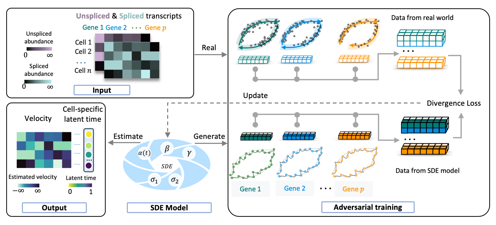
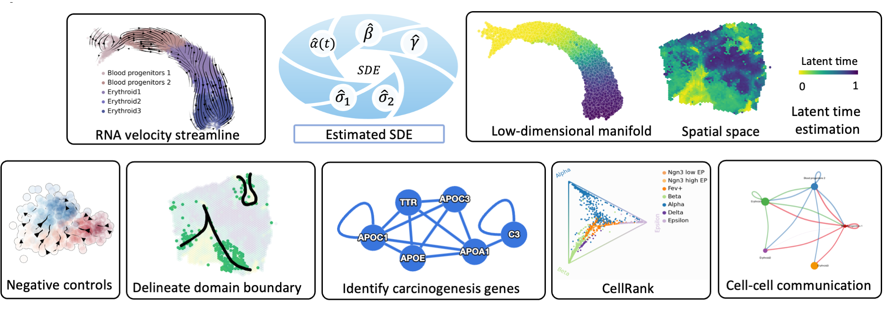

# SDEvelo: A Deep Generative Approach for Transcriptional Dynamics with Cell-Specific Latent Time and Multivariate Stochastic Modeling

## Overview

SDEvelo represents a significant advancement in the analysis of single-cell RNA sequencing (scRNA-seq) data, offering a novel approach to inferring RNA velocity through multivariate stochastic differential equations (SDE). This deep generative model accurately captures the complex, stochastic nature of transcriptional dynamics, providing new insights into cell differentiation and state transitions.

### Workflow and Downstream Analysis



The above image illustrates the workflow of SDEvelo, from input data to the generation of RNA velocity estimates.



This image showcases the various downstream tasks and analyses that can be performed using the results from SDEvelo.

### Key Features

- **Multivariate stochastic modeling**: Captures complex, stochastic transcriptional dynamics across multiple genes simultaneously.
- **Cell-specific latent time estimation**: Provides accurate representation of cellular progression through biological processes.
- **Versatile applicability**: Suitable for both scRNA-seq and sequencing-based spatial transcriptomics data.
- **Computational efficiency**: Designed to be scalable for large datasets.
- **Carcinogenesis detection**: Demonstrates high accuracy in identifying cancerous processes.
- **Facilitation of downstream analyses**: Enables a wide range of biological discoveries through comprehensive output.

### Addressing Limitations in Existing Methods

SDEvelo addresses limitations of traditional RNA velocity analysis methods that rely on ordinary differential equations (ODE) to model individual genes sequentially. By using multivariate SDEs, explicitly modeling uncertainty, and estimating cell-specific latent time across genes, SDEvelo offers a more accurate and comprehensive approach to understanding cell differentiation and state transitions in scRNA-seq studies.

## System Requirements

- **Operating Systems**: Linux (Ubuntu, CentOS), macOS, Windows 10
- **Python Version**: Python 3.8 and above
- **Dependencies**:
  - anndata==0.10.7
  - matplotlib==3.7.1
  - numpy==1.23.5
  - scipy==1.8.1
  - scvelo>=0.3.0
  - seaborn==0.11.2
  - torch==1.13.1+cu117
- **Hardware Requirements**: No non-standard hardware required
- **Installation Time**: Approximately 5 minutes

## Installation Guide

1. Ensure Python 3.8+ is installed on your system.
2. Install SDEvelo via pip:
   ```bash
   pip install sdevelo
   ```

SDEvelo is available on PyPI: [https://pypi.org/project/sdevelo/](https://pypi.org/project/sdevelo/)

## Documentation

For detailed documentation, please visit: [https://sdevelo.readthedocs.io/en/latest/](https://sdevelo.readthedocs.io/en/latest/)

## Demo

### Running the Demo

1. Navigate to the `docs/demo_simulation` directory in the repository.
2. Open and execute the `demo_simulation.ipynb` Jupyter Notebook.

### Expected Output

- A streamline plot depicting transcriptional dynamics
- A latent time heatmap visualizing cell progression over time

### Expected Run Time

Approximately 300 seconds on a typical desktop computer.

## Instructions for Use

1. Configure arguments and parameters for your dataset (refer to `demo_simulation.ipynb` for examples).
2. Run the SDEvelo model.
3. Visualize results based on the estimated SDEvelo model.

Stay tuned for additional demos and updates by checking our repository regularly.
